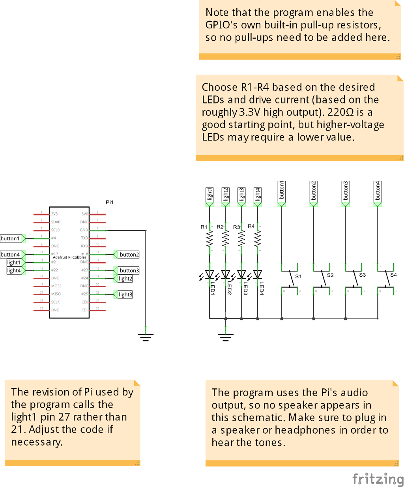

Repeat
======

Example code for Simon-like game for Raspberry Pi using straight GPIO. Sound is
output using the sound device available to pygame.

I, Peter S. May, the author, hereby release the code and sound files for this
project into the public domain, as-is, without the faintest shadow of a
warranty.

Program
-------

This is a Python program that tries (and probably fails in places) to strike a
balance between good programming and demonstrative/educational/pedantic
programming. I'm making no particular effort to be "pythonic", in some cases
because I'm not aware of how and in others because I don't think that way is
right way to do things. (I leave it as an exercise for the student to decide
which.)

That said, it could probably stand to look a little more like it was written by
someone more used to Python.

The game may sometimes exhibit timing that feels slightly loose due to the use
of thread sleeping, rather than busy waiting, for delays. It may help to alter
the `delay()` function by commenting the line calling `pygame.time.wait()` and
uncomment the line calling `pygame.time.delay()`. Because the OS (probably
Raspbian or similar) is not a realtime OS and uses preemptive multitasking,
there are still no guarantees, but in practice things should work out usable,
more or less.

Circuit
-------

Connect buttons from GPIO 4, 18, 23, 17 (clockwise order) to ground. Internal
pull-up resistors are used, so separate pull-ups are not needed.

Connect the anodes of the respective LEDs to 27, 24, 25, 22. Connect each
cathode through an appropriate series resistor (accounting for 3.3V input) to
ground.

Todo
----

- The program is not written in object-oriented style and maintains at least a
  little global state. *This is not a problem* since the program has such a
  narrow scope and games occur only one at a time systemwide. Still, for the
  sake of style, and for educational purposes, the current global functions
  might be grouped into classes which are then instantiated and called from a
  conventional `if __name__ == "__main__":` block.
- The traditional version of this game increased the rapidity of the playback
  as the sequence got longer. This shouldn't be too hard to implement, but it's
  not there yet.
